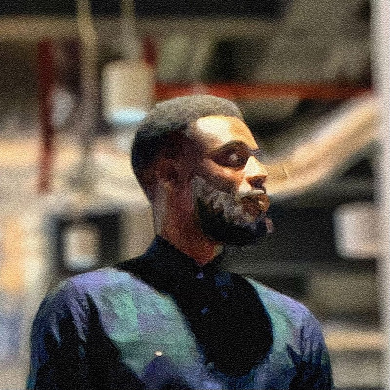

## Connect with us

[![Email][gmail-shield]][gmail-url]
[![LinkedIn][linkedin-shield]][linkedin-url]
[![Discord][discord-shield]][discord-url]

## Backed by

[gmail-shield]: https://img.shields.io/badge/Gmail-red?style=for-the-badge&logo=gmail&logoColor=white
[gmail-url]: mailto:founders@cactuscompute.com

[linkedin-shield]: https://img.shields.io/badge/-LinkedIn-blue.svg?style=for-the-badge&logo=linkedin&colorB=blue
[linkedin-url]: https://www.linkedin.com/company/106281696

[discord-shield]: https://img.shields.io/badge/Discord-5865F2?style=for-the-badge&logo=discord&logoColor=white
[discord-url]: https://discord.gg/nPGWGxXSwr

## About Cactus

As AI becomes increasingly embedded in our daily lives, AI for phones, wearables, medical devices, cameras, drones will become personal. The models that use private data for context should run on-device without communicating with external servers. Cactus is a lightweight, high-performance framework for running AI models locally on mobile devices.

Cactus has unified and consistent APIs across:

- React/JS/TS for cross-platform apps 
- Flutter/Dart for cross-platform apps 
- C/C++ for core builds
- (Swift & Kotlin in dev)

We are redefining on-device AI with the following features:

- Model Context Protocol (MCP)
- Private phone tool use (camera control, gallery search, mail handling etc.)
- Multi-agent support and workflows on-device 
- Thinking mode & on-device reasoning 
- Hardware-aware models (both SOTA ports and foundation models) 

We're committed to keeping our core technology open-source, fostering a community where developers can collaborate to push the boundaries of what's possible with on-device AI.

## Team

<table>
  <tr>
    <td width="50%" align="center">
      <h3>Roman Shemet</h3>
      
      
Experienced Product leader and a former quantitative researcher. Holds an MSc in Financial Economics from the University of Oxford, and previously worked in equity investing and algorithmic trading. A first-hand experience of the importance of data security has motivated the desire to enable on-device, private, and local AI.

    </td>
    <td width="50%" align="center">
      <h3>Henry Ndubuaku</h3>
      
      
Studied Electrical and Computer Engineering, then an MSc in Artificial Intelligence from QMUL under Prof. Matthew Purver. Henry researched Maxar satellite perception models at WISDM, then edge mobile-device models at Deep Render. He contributes to and authored many open-source projects on GPU programming and Edge AI.

    </td>
  </tr>
</table>

## See Cactus in Action!

The apps demonstrate how Cactus lets you:
- Run powerful AI models completely offline
- Build apps that don't need cloud connections
- Create seamless AI experiences that work anywhere

## We are growing!

