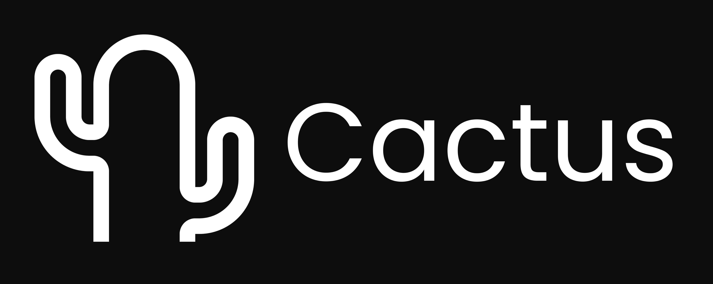

[![Website][website-shield]][website-url]
[![Email][gmail-shield]][gmail-url]
[![LinkedIn][linkedin-shield]][linkedin-url]

[gmail-shield]: https://img.shields.io/badge/Gmail-red?style=for-the-badge&logo=gmail&logoColor=white
[gmail-url]: founders@cactuscompute.com

[linkedin-shield]: https://img.shields.io/badge/-LinkedIn-blue.svg?style=for-the-badge&logo=linkedin&colorB=blue
[linkedin-url]: https://www.linkedin.com/company/106281696

[discord-shield]: https://img.shields.io/badge/Discord-5865F2?style=for-the-badge&logo=discord&logoColor=white
[discord-url]: https://discord.gg/cBT6jcCF

[website-shield]: https://img.shields.io/badge/Website-black?style=for-the-badge&logo=safari&logoColor=white
[website-url]: https://cactuscompute.com

As AI becomes increasingly embedded in our daily lives, AI for phones, wearables, medical devices, drones etc. will become personal. These models that use personal data for context should run on the devices without communicating with external servers whatsoever.  Cactus is a lightweight, high-performance framework for locally running AI models on mobile phones. Cactus has unified and consistent APIs across React-Natiive, Android/Kotlin, Android/Java, iOS/Swift, iOS/Objective-C++, and Flutter/Dart. We also have upcoming features like MCP, phone tool use, thinking, prompt-enhancement, higher-level APIs. We're committed to keeping our core technology open-source, fostering a community where developers can collaborate to push the boundaries of what's possible with on-device AI.

## Team

<table>
  <tr>
    <td width="50%" align="center">
      <h3>Roman Shemet - Founder + CEO</h3>
      
      
Experienced Product leader and a former quantitative researcher. Holds an MSc in Financial Economics from the University of Oxford, and previously worked in equity investing and algorithmic trading. A first-hand experience of the importance of data security has motivated the desire to enable on-device, private, and local AI.

    </td>
    <td width="50%" align="center">
      <h3>Henry Ndubuaku - Founder + CTO</h3>
      
      
Studied Electrical Engineering and Computing and received an MSc in Artificial Intelligence from QMUL under Prof. Matthew Purver. Henry designed satellite vision models for Maxar Defence, and led on-device video model reasearch at Deep Render. He is a contributor to Google JAX and Llama.cpp, and has authoured open-source projects around GPU programming and Edge AI.

    </td>
  </tr>
</table>

## 🎬 See Cactus in Action!

The video demonstrates how Cactus lets you:
- Run powerful AI models completely offline
- Build apps that don't need cloud connections
- Create seamless AI experiences that work anywhere

